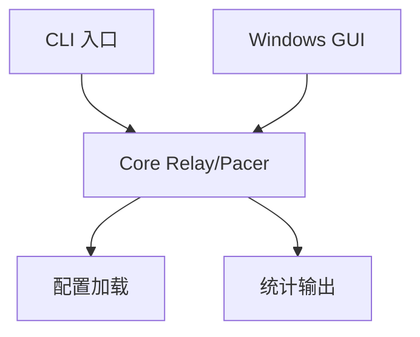

# 技术设计: Sunshine UDP Pacing Proxy

## 技术方案
### 核心技术
- Go 1.22
- Fyne（Windows GUI）
- YAML（配置）

### 实现要点
- 基于 base_port 推导外部/内部端口，internal_offset 默认 1000。
- 单客户端会话：记录最近 client_endpoint，并设置超时清理。
- UDP relay 双向转发；video 方向进入 token bucket pacing。
- control/audio 高优先级或直通，不进入视频队列。
- 统计指标：bps/pps、队列长度、丢包计数。

## 架构设计


## 架构决策 ADR
### ADR-001: 采用单进程共享核心（GUI/CLI 入口复用 core）
**上下文:** 需要 Windows GUI 与 Linux CLI，同时保持实现简洁可维护。
**决策:** GUI 与 CLI 作为两个入口，直接调用 core 模块，不使用独立后台进程。
**理由:** 降低进程间通信复杂度；MVP 交付更快；易于调试。
**替代方案:** GUI 启动独立 CLI 进程 → 拒绝原因: 进程管理与状态同步成本高。
**影响:** 后续若需服务化，可在 Windows 端新增 service 包装。

## API设计
- 暂无对外 API。

## 数据模型
```yaml
base_port: 47989
internal_offset: 1000
video:
  enable: true
  rate_mbps: 16
  burst_kb: 16
  max_queue_delay_ms: 8
  tick_ms: 1
control:
  enable: true
  mode: bypass
audio:
  enable: true
  mode: priority
  max_queue_delay_ms: 10
```

## 安全与性能
- **安全:** 限制外部端口暴露；仅允许最近客户端 IP（可选）。
- **性能:** token bucket pacing + 队列驻留上限；video 丢弃优先保证低延迟。

## 测试与部署
- **测试:** 单元测试覆盖端口映射、pacer 速率与丢弃逻辑。
- **部署:** Windows 打包 GUI 可执行；Linux 以 CLI 运行并加载 YAML 配置。
