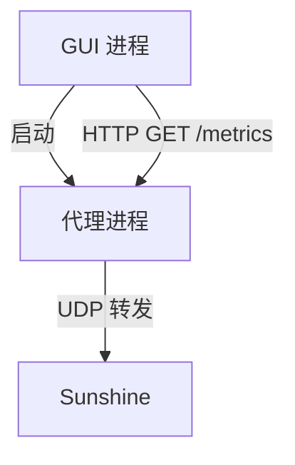

# 技术设计: 代理进程分离与本地 Metrics HTTP

## 技术方案
### 核心技术
- Go 标准库 `net/http` 提供本地 Metrics 服务
- GUI 使用 HTTP 客户端轮询 JSON 指标
- GUI 启动/管理代理子进程（`os/exec`）

### 实现要点
- 代理新增 `--metrics-addr` 与 `--metrics-file` CLI 参数：
  - `--metrics-addr=127.0.0.1:0` 允许内核分配端口
  - 启动后将实际监听地址写入 `--metrics-file`
- GUI 启动代理进程时生成 metrics 文件路径并传入参数，等待文件生成并读取地址。
- GUI 轮询 `GET /metrics`，以 500ms 刷新图表与统计文本。
- GUI 停止时直接终止子进程并清理轮询。

## 架构设计


## 架构决策 ADR
### ADR-007: 采用本地 HTTP Metrics 服务进行进程间解耦
**上下文:** 需要将绘图与转发拆分到不同进程，同时保持实现简单、易调试。  
**决策:** 代理进程暴露本地 HTTP `/metrics`，GUI 轮询获取指标。  
**理由:** 依赖最少、易于跨平台、便于调试与扩展。  
**替代方案:** 本地 IPC（Unix socket/Named Pipe/gRPC） → 拒绝原因: 实现复杂、跨平台适配成本高。  
**影响:** 引入本地 HTTP 服务与进程管理逻辑，需要绑定 127.0.0.1 并设置超时。

## API设计
### GET /metrics
- **响应:** JSON（字段与 `core.Metrics` 一致）
```json
{
  "video_in_bytes": 0,
  "video_out_bytes": 0,
  "video_drops": 0,
  "control_in_bytes": 0,
  "control_out_bytes": 0,
  "audio_in_bytes": 0,
  "audio_out_bytes": 0,
  "video_queue_len": 0
}
```

## 安全与性能
- **安全:** 仅监听 127.0.0.1；metrics 文件写入仅限本地；无敏感信息落盘。
- **性能:** 轮询 500ms；HTTP handler 仅返回快照；GUI 主线程仅做状态更新。

## 测试与部署
- **测试:** 单元测试覆盖 `/metrics` 返回结构；启动代理后通过 HTTP 拉取验证。
- **部署:** 无额外步骤，随现有构建产物发布。
