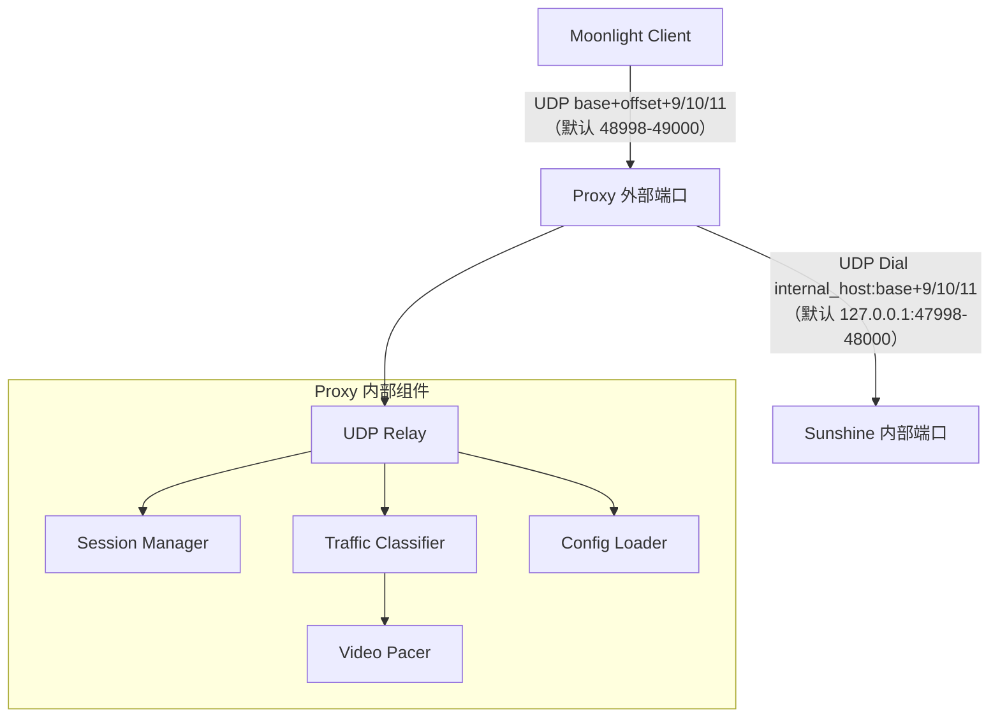
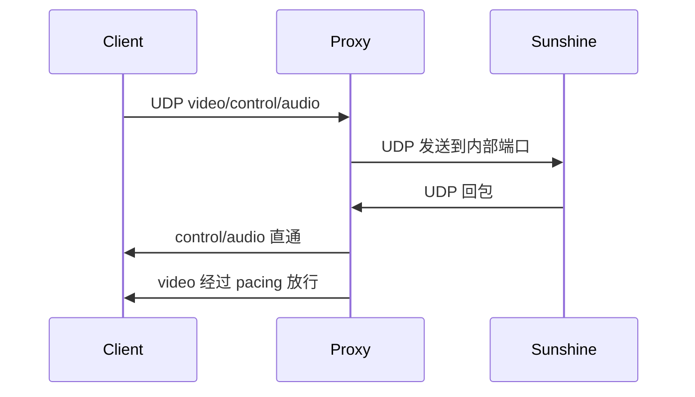

# 架构设计

## 总体架构

## 技术栈
- **后端:** Go
- **前端:** Fyne（仅 Windows）
- **数据:** YAML 配置 + 本地日志

## 核心流程

## 重大架构决策
完整的ADR存储在各变更的how.md中，本章节提供索引。

| adr_id | title | date | status | affected_modules | details |
|--------|-------|------|--------|------------------|---------|
| ADR-001 | 本机 UDP 代理转发 + video pacing | 2026-01-21 | ✅已采纳 | core/config/gui-win/cli | ../history/2026-01/202601211643_sunshine_pacing_proxy/how.md#adr-001-采用单进程共享核心gui-cli-入口复用-core |
| ADR-002 | 允许 internal_offset=0 | 2026-01-23 | ✅已采纳 | config/cli | ../history/2026-01/202601231327_local_47989_forward/how.md#adr-002-允许-internal_offset-0 |
| ADR-003 | 连接日志默认关闭 | 2026-01-23 | ✅已采纳 | config/core/cli | ../history/2026-01/202601231353_connection_logging/how.md#adr-003-连接日志默认关闭 |
| ADR-005 | 回包日志默认关闭 | 2026-01-23 | ✅已采纳 | config/core/cli | ../history/2026-01/202601231513_response_logging/how.md#adr-005-回包日志默认关闭 |
| ADR-006 | pacing 开关默认开启 | 2026-01-23 | ✅已采纳 | config/core/cli | ../history/2026-01/202601231529_pacing_bypass/how.md#adr-006-pacing-开关默认开启 |
